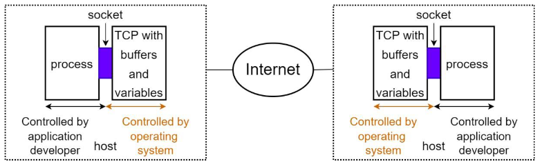
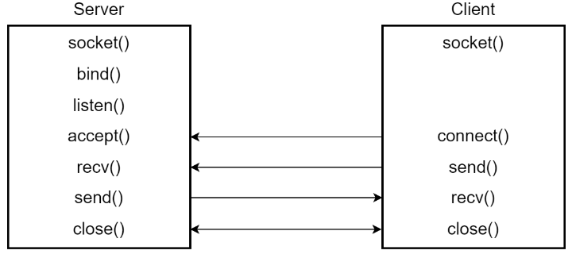
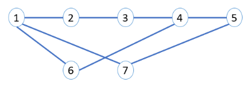
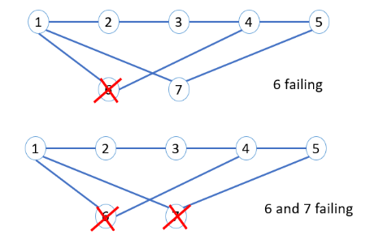

# Simulate Link State Routing Protocol with Java Socket Programming

## Goal

In this project, you are supposed to develop a pure user-space program which simulates the major functionalities of a routing device running a simplified Link State Routing protocol.

To simulate the real-world network environment, you have to start multiple instances of the program, each of which connecting with (some of) others via socket. Each program instance represents a router or host in the simulated network space. Correspondingly, the links connecting the routers/hosts and the IP addresses identifying the routers/hosts are simulated by the in-memory data structures.

By defining the format of the messages transmitting between the program instances, as well as the parser and the handlers of these messages, you simulate the routing protocol with the user- space processes.

## Prerequisite

Before you start this project, please ensure that you understand the basic concept of routing, especially Link State Routing, which is taught in class.

### Socket Programming 101

Socket is the interface between the application layer and transmission layer



The existence of Socket interface greatly reduces the complexity of developing network-based applications. When the processes communicate via socket, they usually play two categories of roles, `server` and `client`. The usages of socket in these two roles are different.



In `server` side, the program creates a socket instance by calling `socket()`. With this socket instance, you can `bind()` it to a specific IP address and port, call `listen()` to wait for the connecting requests, `accept()` to accept the connection. After you call `ACCEPT()`, you can transmit data with the client by calling and `recv()` and `send()`. After you finish all tasks in server side, you can call `close()` to shut down the socket.

In `client` side, the story seems a bit simpler, after you call `socket()` to create a socket instance, you only need to call `connect()` with the specified IP address and port number to request the service from the server side. After the connection is established, the following process is very similar to server side, i.e. transmit data with `recv()` and `send()`, and shut down with `close()`.

This is the general process of the socket-based network communication. To understand it better, you are suggested to read the article in [here](http://gnosis.cx/publish/programming/sockets.html). The article is described in C programming language, which exposes many details of network data transmission but helpful to understand the concepts.

## Java Socket Programming

Different programming languages offer their own abstractions over socket interface to help the user to develop network-based programs. You are requestd to finish this project in Java. Java provides higher level abstraction for socket than C. In server side, You only need to call `ServerSocket serverSocket = new ServerSocket(port);` to create socket, bind, listen in one shot. In client side, `Socket client = new Socket(serverName, port);` to create socket instance and connect to the remote server.

The data tranmission between the server and client is through stream. For example, the following code snippet writes data to remote server and waits for the feedback.

```java
OutputStream outToServer = client.getOutputStream();
DataOutputStream out = new DataOutputStream(outToServer);
out.writeUTF("Hello from " + client.getLocalSocketAddress());
InputStream inFromServer = client.getInputStream();
DataInputStream in = new DataInputStream(inFromServer);
System.out.println("Server says " + in.readUTF());
```

Here we say `wait for the feedback` because `getInputStream().read()` is a blocking method. According to the Java API, "This method blocks until input data is available, the end of the stream is detected, or an exception is thrown." (Blocking Read).

The blocking operations are always performance killer for high-throughput scenarios, e.g. routers. We have to develop some ways to handle concurrent socket requests.

Recommended Reading: Java Socket Programming

## Handle Concurrent Socket Requests

In this project, you are supposed to develop a multi-threaded server to handle concurrent socket requests/messages from the client. Recommended Reading: Multi-threaded Java Server

# Simulation of Link State Routing

The basic idea of link state routing is that every router maintains its own description of the connectivity of the complete network. As a result, each router can calculate the best next hop for all possible destinations independently. The key point for the correctness of Link State Routing Protocol is to synchronize the network description in all nodes.

In the following paragraphs, we will describe your tasks around the network description synchronization.

## Router Design

One of the major tasks in this project is to implement the `Router` class which represents a router instance in the simulated network.

## How Simulation Works

Before introducing the components and functionalities in router, we have to emphasize how the "simulation" mechanism (in this project) works.

In the Socket introduction part, we have described that each socket-based program has its own IP address and port, which are the identifiers used to communicate with other processes. In this project, you need to use "Process IP" and "Process Port" to establish connection via socket. On the other side, in the "simulated network", we assign a "simulated ip address" to each router. This ip address is only used to identify the router program instance _in the simulated network SPACE_ , but _not_ used to communicate via sockets.

You have to map between this simulated ip address and the "Process IP" and "Process Port" to simulate the link state routing protocol. For example, you run two simulated router instances at port 50000 and 50001 respecitively, and the machine where you run the programs has the ip address of "172.12.1.10". When you create socket instance, you have to use `172.12.1.10:50000` or `172.12.1.10:50001` to connect two program instances. On the other side, you will have to build links in a simulated network topology. The program instance started at `172.12.1.10:50000` might be assigned with a simulated IP address of `192.168.1.10`. You have to use this `192.168.1.10` to describe the network topology, etc. This explains why you have to build a map between the simulated ip address and the "Process IP" and "Process Port".

## Data Structures in Routers

Each router is identified by a simulated "IP address", which is a String variable. In this project, the routers are assumed to have 4 ports, which means that the router class contains a 4-length, `Link` typed array. When the router is connected with the other, you shall fill the array with a Link object. If the ports are all occupied, the connection shall not be established.

The most important component in router side is the _Link State Database_. Each router maintains its own _Link State Database_, which is essentially a map from the router's IP address to the link state description originated by the corresponding router. The shortest path algorithm runs over this database.

## Command-line Console

In addition to the components introduced above, you have to develop a console for the router. When you start the router program, the terminal interface (command line based) should show to the user, and it allows the user to input following commands:

- (15 points) `attach [Process IP] [Process Port] [IP Address]`: this command establishes a link to the remote router which is identified by `[IP Address]`. After you start a router program instance, you first have to run command to establish the new links to the other routers. This operation is implemented by adding the new Link object in the port array (check the sketch code). In this command, besides the Process IP/Port and simulated IP Address.
- (15 points) `start`: start this router and initialize the database synchronization process. After you establish the links by running `ATTACH`, you will run `START` command to send `HELLO` and `LSAUPDATE` messages to all connected routers for the Link State Database synchronization. This operation will be illustrated in the next section.
- (15 points) `connect [Process IP] [Process Port] [IP Address]`: similar to `ATTACH` command, but directly trigger the database synchronization without the necessary to run `START` (this command can only be run after `START`).
- (15 points) `disconnect [Port Number]`: remove the link between this router and the remote one which is connected at port `[Port Number]` (port number is between 0 - 3, i.e. four links in the router). Through this command, you are triggering the synchronization of Link State Database by sending `LSAUPDATE` (Link State Advertisement Update) message to all neighbors in the topology. This process will also be illustrated in the next section.
- (15 points) `detect [IP Address]`: output the routing path from this router to the destination router which is identified by `[IP Address]`.
- (10 points) `neighbors`: output the IP Addresses of all neighbors of the router where you run this command.
- (15 points) `quit`: exit the program. NOTE, this will trigger the synchronization of link state database

# Link State Database Synchronization and Update

## Start

After you run `START` message, the router where this command is triggered should send `HELLO` messages to all routers which have been linked via `ATTACH` command.

The process of handling `HELLO` is as following:

a. Router 1 (R1) broadcasts `HELLO` messages through all ports.
b. The remote end (R2) receives a `HELLO` message, and sets the status in the RouterDescription of R1 as `INIT`, then sends `HELLO` to R1.
c. R1 receives `HELLO` from R2, sets the status of R2 as `TWO_WAY`, and sends `HELLO` to R2.
d. R2 receives `HELLO` from R1, and set the status of R1 as `TWO_WAY`

## Synchronize Link State Database

Synchronization of Link State Database happens when the link state of a router changes.

The router where the link state changes broadcasts `LSAUPDATE` which contains the latest information of link state to all neighbors. The routers which receive the message will in turn broadcast to their own neighbors except the one which sends the `LSAUPDATE`.

`LSAUPDATE` contains one or more `LSA` (Link State Advertisement) structures which summarize the latest link state information of the router. To update the local link state database with the latest information, you have to distinguish the `LSAUPDATE` information generated from the same router with a monotonically increasing sequence number. The router receiving the `LSAUPDATE` only updates its Link State Database when the `LSAUPDATE`'s sequence number is larger than maximum sequence number from the same router it just received.

Link State Database synchronization is triggered by `START`, `CONNECT`, and `DISCONNECT`

## Shortest Path Finding

Based on LSA entries saved in Link State Database, you can build the graph representing the topology of network. With the graph, you can find the shortest path from the router to all the other ones with Dijkstra algorithm. The shortest path is defined to be the one with minimum number of hops between a source and destination routers.

When you run `detect [IP Address]` command, the Dijkstra algorithm runs over the database and outputs results.

# Mapping This Document to Sketch Code

We provide the sketch code along with this document. Please note that you should feel free to add fields, methods, helper functions to the sketch code.

In this section, we provide an brief introduction to the sketch code.

## Router Design

We provide the sketch code of the Router in [Router.java](./src/main/java/socs/network/node/Router.java):

- `ports` is the array of `Link` which stands for the 4 ports of the router;
- `rd` is an instance of `RouterDescription`, which is a wrapper of several describing fields of
  the router: `processIPAddress` and `processPortNumber` are where the server socket
  of the router program binds at; `simulatedIPAddress` is the simulated IP address and
  the identifier of this router; `STATUS` is the instance of `RouterStatus` describing the stage
  of the database synchronization (see more explanations in the code);
- `lsd` is the instance of [`LinkStateDatabase`](./src/main/java/socs/network/node/LinkStateDatabase.java) (LSD). LSD contains a
  HashMap which maps the `linkStateId` to the Link State Advertisement (LSA). LSA is the
  data structure storing `LinkDescription` the of in the router which advertised this LSA.

In the [Router](./src/main/java/socs/network/node/Router.java) class, you have to implement the functionalities of creating socket instances (Server Socket and Client Socket) and communicating via them. Besides that, you have to complete the implementation of the functions with the name starting with `processing`, which are the handlers of different commands triggered by the user. When you implement the handler of the `detect` command, you also need to fill the implementation of the method named `getShortestPath` in [LinkStateDatabase](./src/main/java/socs/network/node/LinkStateDatabase.java) Class.

## Messages

The class in [SOSPFPacket](./src/main/java/socs/network/message/SOSPFPacket.java) defines the message format transmission among routers. The messages are distinguished by the field of `sospfType`, where 0 stands for `HELLO` and 1 stands for `LinkStateUpdate`.

`LinkStateUpdate` message contains a set of LSA instances, which are all LSAs stored in the router originating this message (To reduce the load amount of this project, we simplify this database synchronization process, please read the textbook for the complete definition of a link state routing protocol). Each [LSA](./src/main/java/socs/network/message/LSA.java) has three fields: `linkStateId` is the simulated IP address of the router originating from this LSA. `lsaSeqNumber` describes the version of the LSA, when synchronizing database, you have to compare this value of the existing and the newly arrived LSA from the same server to prevent updating the database with stale values. `links` is a set of [`linkDescription`](./src/main/java/socs/network/message/LinkDescription.java) instances.

## Configuration

The sketch code provides a configuration module to read the config file for the program, we have a predefined configuration entry named `socs.network.router.ip` defining the simulated ip address of the router instance. You can add other entries like the ip address and the port which the socket binds to for your necessary.

## Compile the Program

We use maven to compile and package the program into a jar file.

- compile (you have to install [maven](http://maven.apache.org/download.cgi) first)

```
mvn compile
```

- package all class files into a fat jar file

```
mvn compile assembly:single
```

Then you can run the program with the java command, e.g. `java -jar -cp router.jar config.conf`

# Evaluation

In this assignment, you are supposed to implement all the command-line console functionalities described above to build, change, and query the shortest path of a particular network topology. Here is an example of a network topology you can use it for testing purpose:



Some network topology changes can be injected into the network using `connect`, `disconnect` and `quit` commands. An example of network changes is shown in the following figure:



The evaluation of the assignment is in the form of a demo. The TA will ask the students to show different functionalities of the program and will also ask the students to explain the implementation of some code snippets.

In the demo, the TA will ask you to run `ATTACH`, `START` and `NEIGHBORS` commands to build network topology. When you run `ATTACH`, the router that received this attach request should be able to decide whether it will accept this attach. For example, if Router 2 tries to attach Router 1, the Router 1 can choose either accept or reject this attach request. (Hint: to achieve this goal, you may implement a `RequestHandler` function that handles the incoming attach request.)

The terminal window of Router 1 should output

```
received HELLO from 192.168.1.3;

Do you accept this request? (Y/N)

$ N

You rejected the attach request;
```

The terminal window of Router 2 should output

```
Your attach request has been
rejected;
```

When you run `START`, you have to print out the log of change of the state. For example, if you `ATTACH` Router 2 to Router 1 (192.168.1.2) and run `START`, terminal window of Router 1 should output

```
received HELLO from 192.168.1.3;

set 192.168.1.3 STATE to INIT;

received HELLO from 192.168.1.3;

set 192.168.1.3 STATE to TWO_WAY;
```

The window of Router 2 should print

```
received HELLO from 192.168.1.2;

set 192.168.1.2 STATE to TWO_WAY;
```

When you run `NEIGHBORS`, the window of the router where you run the command should print

```
IP Address of neighbor1

IP Address of neighbor2

IP Address of neighbor3

...
```

Then the TA will ask you to run `detect [IP Address]` to output the shortest path from the router where you run the command to the destination.

The expected format of output is (suppose you are running the command in Router 1 with simulated IP 192.168.1.2 and detect 192.168.1.5 (simulated IP address of Router 5) is executed)

```
192.168.1.2 -> 192.168.1.7 -> 192.168.1.5
```

Finally, the TA will ask you to have some topology updates by running `connect`, `disconnect` and `quit` commands, and then run `detect` to output the latest version of the shortest path. The output of the detect here should be like the previous one. For example, in the example network topology above, the path from Router 1 to Router 5 after quitting Router 6 and 7 should be

```
Simulated IP address of Router 1 -> Simulated IP address of Router 2 ->
Simulated IP address of Router 3 -> Simulated IP address of Router 4 ->
Simulated IP address of Router 5
```

# Deliverables

You should submit a zip file including the whole java project as well as a brief README file to provide running instructions and important implementation description into your group submission on MyCourses.
